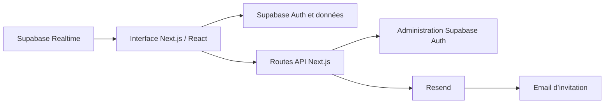

<div align="center">

# 📊 Family Investment Tracker

**Un objectif commun. Des contributions visibles. Un suivi familial simplifié.**

Application web en français pour centraliser les versements d’une famille, suivre leur répartition et mesurer la progression vers un objectif financier partagé.


[Présentation](#-présentation) · [Fonctionnalités](#-fonctionnalités) · [Installation](#-installation) · [Données](#-données-attendues) · [État du projet](#-état-du-projet)

</div>

---

## 🏡 Présentation

**Family Investment Tracker**, également nommé **Family Invest** dans l’interface, rassemble les contributions des membres d’une famille dans un espace commun. Chacun peut enregistrer un versement, consulter l’historique et visualiser sa participation à l’effort collectif.

Le tableau de bord présente les montants saisis en euros, leur répartition par contributeur et leur évolution mensuelle. Un objectif configurable permet de suivre le montant restant à réunir.

Le périmètre actuel porte sur les contributions déclarées manuellement. La connexion à des comptes bancaires, l’exécution de paiements et le calcul de rendements ne sont pas implémentés.

## ✨ Fonctionnalités

### Tableau de bord

- Total des contributions et progression vers l’objectif commun.
- Montant restant à réunir.
- Graphique de répartition par contributeur.
- Évolution des versements sur les six derniers mois.

### Contributions et historique

- Ajout d’un montant positif avec une date et un commentaire facultatif.
- Affichage des cinq derniers versements et du total du mois en cours.
- Recherche dans l’historique par nom, commentaire ou montant.
- Filtre par contributeur et tri chronologique.
- Export CSV des résultats filtrés.

### Profil et préférences

- Modification du nom affiché.
- Statistiques personnelles : total versé, nombre de contributions, moyenne et part du total collectif.
- Dates du premier et du dernier versement.
- Interface adaptée aux petits et grands écrans, avec thème clair ou sombre.
- Choix de conservation des préférences dans le navigateur.

### Accès et administration

- Connexion par email et mot de passe avec Supabase Auth.
- Formulaire de demande d’accès.
- Interface d’approbation ou de refus des demandes.
- Envoi d’invitations par email et création du mot de passe.
- Interface de gestion des utilisateurs et de modification de l’objectif.
- Abonnement aux modifications de l’objectif via Supabase Realtime.

> Les écrans et routes d’administration sont présents, mais leur contrôle d’accès et certaines opérations restent à finaliser. Les limites identifiées sont détaillées dans la section [État du projet](#-état-du-projet).

## 🛠️ Stack technique

| Usage | Technologies |
| --- | --- |
| Application et routes serveur | Next.js 16.1.6, App Router |
| Interface | React 19.2.3, TypeScript 5 |
| Styles et composants | Tailwind CSS 4, shadcn/ui, Radix UI, Lucide |
| Graphiques | Chart.js, react-chartjs-2 |
| Dates et calendrier | date-fns, react-day-picker |
| Authentification et données | Supabase Auth, PostgreSQL via Supabase, `@supabase/ssr` |
| Mise à jour de l’objectif | Supabase Realtime |
| Emails d’invitation | Resend et Supabase Auth |
| Qualité du code | ESLint |

## 🧭 Architecture



Les pages consultent les données avec le client Supabase du navigateur. Les routes Next.js gèrent notamment les invitations. L’accès aux données dépend donc des permissions et politiques définies dans le projet Supabase.

## 🚀 Installation

### 1. Préparer les services

Le projet nécessite :

- Un environnement Node.js compatible avec Next.js 16 et npm.
- Un projet Supabase avec Auth et les tables attendues par l’application.
- Un compte Resend et une configuration d’envoi pour le parcours d’invitation utilisé par l’administration.

**Le schéma SQL, les migrations et les politiques Supabase ne sont pas versionnés dans ce dépôt.** Une installation sur un nouveau projet Supabase nécessite donc de préparer la base et ses permissions ; les variables d’environnement seules ne suffisent pas.

### 2. Installer les dépendances

Depuis la racine du dépôt :

```bash
npm ci
```

### 3. Configurer l’environnement

Crée un fichier `.env.local` à la racine, ou complète celui déjà présent avec les variables suivantes :

```dotenv
NEXT_PUBLIC_SUPABASE_URL=https://votre-projet.supabase.co
NEXT_PUBLIC_SUPABASE_ANON_KEY=votre_cle_anon
NEXT_PUBLIC_SITE_URL=http://localhost:3000
SUPABASE_SERVICE_ROLE_KEY=votre_cle_service_role
RESEND_API_KEY=votre_cle_resend
```

| Variable | Rôle |
| --- | --- |
| `NEXT_PUBLIC_SUPABASE_URL` | URL du projet Supabase |
| `NEXT_PUBLIC_SUPABASE_ANON_KEY` | Clé utilisée par les clients Supabase navigateur et serveur actuels |
| `NEXT_PUBLIC_SITE_URL` | Adresse de l’application utilisée pour construire le retour d’invitation |
| `SUPABASE_SERVICE_ROLE_KEY` | Clé privilégiée utilisée uniquement dans les routes serveur d’invitation |
| `RESEND_API_KEY` | Clé d’envoi des emails via Resend |

Les fichiers `.env*` sont ignorés par Git. Les valeurs préfixées `NEXT_PUBLIC_` sont destinées au navigateur ; les clés privilégiées doivent rester côté serveur.

### 4. Préparer le parcours d’invitation

Configure les URL de l’application et de retour d’authentification dans ton projet Supabase. Le code construit le retour sous cette forme :

```text
http://localhost:3000/auth/callback
```

Pour un autre environnement, adapte `NEXT_PUBLIC_SITE_URL` et la configuration de redirection correspondante.

L’expéditeur Resend est actuellement fixé dans [`src/app/api/admin/invite/route.ts`](src/app/api/admin/invite/route.ts). Adapte-le à la configuration d’envoi de ton compte.

### 5. Démarrer l’application

```bash
npm run dev
```

Ouvre ensuite **http://localhost:3000**.

Le parcours prévu est : demande d’accès → approbation → email d’invitation → création du mot de passe → tableau de bord. La création du premier administrateur et les règles qui définissent ses droits ne sont pas fournies dans le dépôt.

## 🗄️ Données attendues

Les champs ci-dessous sont déduits des lectures et écritures présentes dans le code. Ils décrivent les besoins de l’application, pas un schéma SQL complet ni l’état vérifié d’une base distante.

| Table | Champs utilisés | Usage |
| --- | --- | --- |
| `profiles` | `id`, `name`, `created_at` | Profil associé à l’utilisateur connecté |
| `contributions` | `id`, `user_id`, `amount`, `date`, `comment`, `created_at` | Versements et historique |
| `settings` | `key`, `value`, `updated_at` | Paramètres partagés, dont l’objectif |
| `access_requests` | `id`, `email`, `status`, `created_at` | Demandes d’accès |

Points nécessaires au fonctionnement :

- `profiles.id` doit correspondre à l’identifiant utilisateur de Supabase Auth.
- Une relation doit permettre les jointures entre `contributions` et `profiles`. Les requêtes utilisent `profiles!inner(name)` : un versement sans profil associé peut être absent des vues concernées.
- Les champs non fournis lors des insertions, comme les identifiants, les dates de création et le statut initial d’une demande, nécessitent une valeur par défaut adaptée.
- Une demande en attente utilise le statut `pending`, puis `approved` ou `rejected`.
- La ligne de paramètres `key = 'goal_amount'` doit exister pour être modifiée par l’interface. Le code utilise **50 000 €** comme objectif de repli.
- La réception des modifications de l’objectif dépend de la configuration Realtime de `settings`.
- La création des profils, les permissions et les politiques RLS doivent être configurées côté Supabase ; aucun mécanisme de provisionnement n’est fourni ici.

## 🗺️ Pages et routes

| URL | Fonction |
| --- | --- |
| `/` | Point d’entrée de l’application |
| `/login` | Connexion |
| `/request-access` | Demande d’accès |
| `/auth/callback` | Traitement du retour d’authentification |
| `/auth/set-password` | Définition du mot de passe |
| `/dashboard` | Vue d’ensemble et graphiques |
| `/contributions` | Saisie et derniers versements |
| `/history` | Historique, filtres et export CSV |
| `/profile` | Profil et statistiques personnelles |
| `/admin` | Demandes, utilisateurs et objectif |

| Méthode | Route API | Fonction présente dans le code |
| --- | --- | --- |
| `POST` | `/api/admin/invite` | Générer une invitation, envoyer l’email via Resend et approuver la demande |
| `GET` | `/api/admin/users` | Demander la liste des utilisateurs à Supabase Auth |
| `DELETE` | `/api/admin/users` | Demander la suppression d’un utilisateur |
| `POST` | `/api/invite-user` | Envoyer une invitation avec Supabase Auth |

## 🗂️ Structure du projet

```text
family-investment-tracker/
├── public/                         # Ressources statiques
├── src/
│   ├── app/
│   │   ├── api/                    # Routes serveur et invitations
│   │   ├── auth/                   # Retour d’authentification et mot de passe
│   │   ├── admin/                  # Interface d’administration
│   │   ├── dashboard/              # Indicateurs et graphiques
│   │   ├── contributions/          # Ajout de versements
│   │   ├── history/                # Historique et export
│   │   ├── profile/                # Profil personnel
│   │   ├── login/                  # Connexion
│   │   └── request-access/         # Demande d’accès
│   ├── components/                 # Formulaires, navigation et composants UI
│   └── lib/                        # Clients Supabase, session et préférences
├── components.json                 # Configuration shadcn/ui
├── next.config.ts
├── package.json
├── package-lock.json
└── README.md
```

## 🧪 Commandes disponibles

| Commande | Usage |
| --- | --- |
| `npm run dev` | Démarrer le serveur de développement |
| `npm run lint` | Exécuter ESLint |
| `npm run build` | Construire l’application |
| `npm start` | Démarrer l’application après compilation |

Aucune suite de tests automatisés n’est actuellement définie dans `package.json`. Le parcours complet dépend d’une configuration Supabase et Resend opérationnelle.

## 🚧 État du projet

L’interface et les principaux parcours sont présents. Les éléments suivants restent à consolider avant une utilisation en production :

- **Droits d’administration** : la page `/admin` et les routes d’invitation ne vérifient pas actuellement le rôle de l’appelant. Les routes d’invitation utilisent une clé privilégiée ; elles nécessitent un contrôle d’autorisation côté serveur.
- **Gestion des utilisateurs** : `/api/admin/users` appelle les méthodes Admin avec le client serveur configuré à partir de la clé publique et de la session. Cette configuration ne fournit pas les privilèges nécessaires aux opérations Admin.
- **Base reproductible** : ajouter les migrations, les politiques RLS et le mécanisme de création des profils permettrait de préparer un nouvel environnement depuis le dépôt.
- **Invitations** : le lien d’invitation est actuellement écrit dans les logs serveur ; cette journalisation doit être retirée.
- **Regroupement des contributeurs** : les graphiques regroupent les contributions par nom affiché. Deux membres portant le même nom sont donc fusionnés dans cette vue.
- **Export CSV** : l’échappement des guillemets et le traitement des cellules interprétables comme formules restent à renforcer.

Ces constats proviennent du code du dépôt. La configuration distante de Supabase et de Resend n’a pas été auditée.

---

<div align="center">

**Family Invest** · Suivre ensemble les contributions à un projet commun.

</div>
